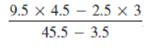

# Lab 2

**Notes**

- Type all the programs from scratch. Do not copy and paste. It will help you to learn the syntax.
- If your program doesn't work on the first try don't worry. Debugging is a skill that you will develop over time.
- Remember to save and recompile every time you make a change to your program.
- If you get errors when you compile, go back and make sure you typed everything correctly. Proper capitalization, spelling, matching {}, etc.
- If you get stuck, ask your TA for help. That's what they are here for!

**Problems**

1. Create a program that prints your name to the console two times, once per line.

```java

System.out.println("Mike");
System.out.println("Mike");

```

2. Create a program that prints your name to the console two times, on the same line.

```java

System.out.print("Mike");
System.out.print("Mike");

```

3. Create a program that prints your name in a box:

```

+-------+
| Name |
+-------+

```

```java

    System.out.println("+------------------+");
    System.out.println("|                  |");
    System.out.println("|     Michael      |");
    System.out.println("|                  |");
    System.out.println("+------------------+");

```

4. Write a program that prints "Welcome to Java" 3 times.

```java

    System.out.println("Welcome to Java!");
    System.out.println("Welcome to Java!");
    System.out.println("Welcome to Java!");

```

5. Write a program that displays the result of the equation below (Remember — Java follows PEMDAS).



```java

System.out.println((9.5*4.5-2.5*3)/45.4-3.5);

```

6. Write a program that prints the summation of the following series:<br>
   1 + 2 + 3 + 4 + 5 + 6 + 7 + 8 + 9

```java

    System.out.println(1+2+3+4+5+6+7+8+9);

```

7. <b>Factorial</b> is represented in math by the <b>!</b> symbol. For example, 4! = 4 \* 3 \* 2 \* 1 = 24. Write a program that calculates the factorial of the number 7. <b>7!</b>

```java

    System.out.println(1*2*3*4*5*6*7);

```

8. What do the following lines display? Do them on paper then check by compiling and running.<br>
   a. System.out.println(2+3);<br>
   b. System.out.println(“2”+3);<br>
   c. System.out.println(“2”+”3”);<br>
   d. System.out.println(1+2+3+”4”+5+6);<br>
   e. System.out.println(“2”+3+4);<br>
   f. System.out.println(“2”+(3+4));<br>
   Why do e and f display different results?<br>
   g. System.out.println(‘a’+1);<br>
   h. System.out.println(‘a’+”1”+’P’);

```java

    /* a. */ System.out.println(2+3);
    /* b. */ System.out.println("2"+3);
    /* c. */ System.out.println("2"+"3");
    /* d. */ System.out.println(1+2+3+"4"+5+6);
    /* e. */ System.out.println("2"+3+4);
    /* f. */ System.out.println("2"+(3+4));
    /*
    e and f are different because e is using concatenation
    (merging of two Strings), while in f, 3+4 is being solved
    first as an addition problem since it's in the parentheses.
    Remember, Java follows PEMDAS, 3+4 will be solved first
    THEN 2 and the result will concatenate.
        */
    /* g. */ System.out.println('a'+1);
    /* h. */ System.out.println('a'+"1"+'P');

```

9. Using printf, write a program that displays the following table. There
   are 6 spaces between each column in the top row:

```

Employee ID: Hourly
Sally 12345 24.50
John 55555 19.32
Billy 34109 31.21

```

```java

    System.out.println("\nQuestion 9:");
    System.out.printf("%-15s%-9s%s%n", "Employee:", "ID:", "Hourly Rate:");
    System.out.printf("%-15s%-9d%.2f%n", "Sally", 12345, 24.5);
    System.out.printf("%-15s%-9d%.2f%n", "John", 55555, 19.32);
    System.out.printf("%-15s%-9d%.2f%n", "Billy", 34109, 31.21);

```

<br>
10) Write a program that saves the following information in variables and then prints it to the console:

```

Name: John Doe
Age: 20
Height: 5.11

```

John Doe, 20, and 5.11 should be saved in variables.

````

```java

    String name = "John Doe";
    int age = 20;
    double height = 5.11;
    System.out.println("Name: " + name);
    System.out.println("Age: " + age);
    System.out.println("Height: " + height);

````
