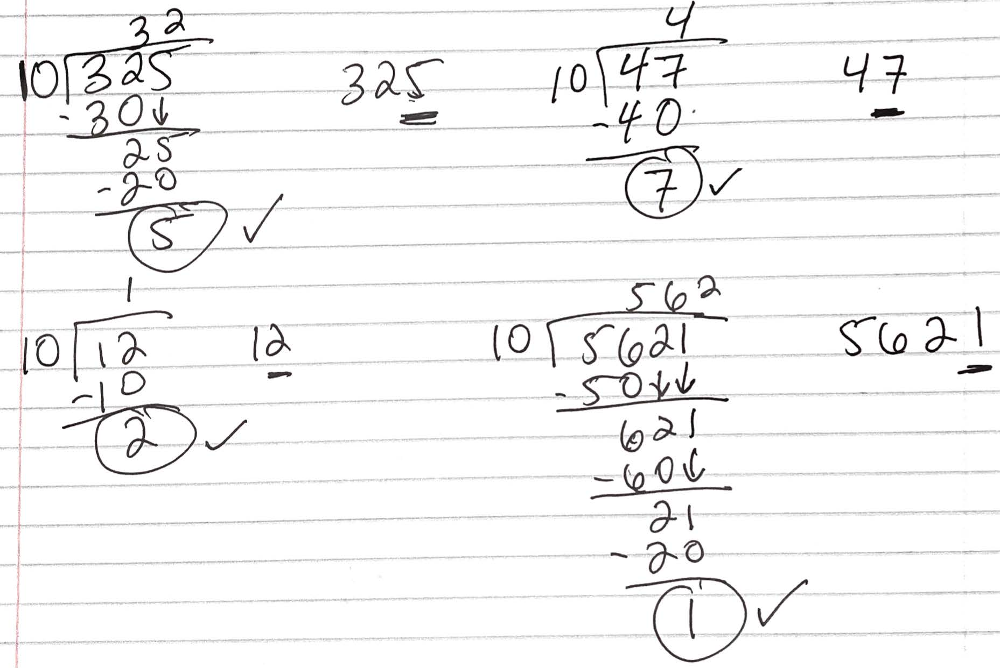

# Week 3: Computer Science 1

## The Power of Modulus

---

When I presented the arithmetic operators, I mentioned that the modulus operator is used to find the remainder of a division. This is a very powerful operator that can be used in many different ways. Let's review division first.

```java

System.out.println(10/5); // Output: 2
System.out.println(10/4); // Output: 2 Integer Division
System.out.println(10.0/4); // Output: 2.5
System.out.println(10/4.0); // Output: 2.5
```

Remember one of the values needs to be a decimal to get a decimal result. If both are integers, the result will be an integer.

---

<b>Modulus</b> or remainder is the value left over after a division. When we do division, we get two values: the quotient and the remainder.

- The quotient: The whole part.
- The remainder: The fractional part.

The possible remainders are 0 to (divisor - 1) or in other words, the remainder is always less than the divisor. In computer science we say <b>0 to n-1</b>.

Possible remainders for n = 5,10, & 100 are:

- 5 is 0-4
- 10 is 0-9
- 100 is 0-99

Why cant <b>n</b> be a remainder?

Because we could have divided by <b>n</b> one more time.

---

Let's look at a few examples with long division.

- 24/2 = ?
- 24%2 = ?

- 123/5 = ?
- 123%5 = ?

- 1040/20 = ?
- 1040%20 = ?

---


- 24/2 = 12 (Quotient)
- 24%2 = 0 (Remainder or Modulus)

---


- 123/5 = 24 (Quotient)
- 123%5 = 3 (Remainder or Modulus)

---


- 1040/20 = 52 (Quotient)
- 1040%20 = 0 (Remainder or Modulus)

---

We can use the modulus operator to determine if a number is even or odd.

If a number is even, the remainder when divided by 2 is 0. If a number is odd, the remainder when divided by 2 is 1.

Why 1? Because the remainder is always less than the divisor. The possible remainders are 0 to (divisor - 1) or <b>0 to n-1</b>.

<div class="columns">
<div>

- 2%2 = 0
- 10%2 = 0
- 100%2 = 0

</div>

<div>

- 3%2 = 1
- 11%2 = 1
- 101%2 = 1

</div>
</div>

---

What else can we use the modulus operator for?

- Testing divisibility
- Converting units (age, time, money, etc.)
- Generating random numbers
- Finding the digits of a number
- And a bunch of other things!

We'll be using modulus in class and lab.

---

<b>Testing divisibility</b> is a common use of the modulus operator. We can use the modulus operator to determine if a number is divisible by another number.

<b>a</b> is divisible by <b>b</b> if <b>a%b</b> is 0.

- Is 104 divisible by 2?
  104 % 2 = 0 so yes.

- Is 104 divisible by 5?
  104 % 5 = 4 so no.

---

<b>Converting units</b> is another common use of the modulus operator. We can use the modulus operator to convert units of time, money, age, etc.

How many years old is a 18 month old child?

1. We know there are 12 months in a year so we should divide 18 by 12 to get the number of years.

18 / 12 = 1 year (integer division)

2. Now we need the remaining months.

18 % 12 = 6 months

So a 18 month old child is 1 year and 6 months old. The quotient is the number of years and the remainder is the number of months.

---

Now try writing a program in Java that will do this for you.

How many years old is a 18 month old child?

---

```java

class Age {
    public static void main(String[] args)
    {
        int months = 18;
        int years = months / 12;
        int remainingMonths = months % 12;

        System.out.println(years + " years and " + remainingMonths + " months old.");
    }
}
```

```
1 years and 6 months old.
```

---

Let's try another example.

How many dollars and cents is 375 cents?

Like before, first find the dollars with division. We know there are 100 cents in a dollar so we should divide 375 by 100 to get the number of dollars.

1. 375 / 100 = 3 dollars (integer division)

Next find the remaining cents with modulus.

2. 375 % 100 = 75 cents

So 375 cents is 3 dollars and 75 cents.

---

Write the program in Java that will do this for you.

How many dollars and cents is 375 cents?

---

```java

class Money {
    public static void main(String[] args)
    {
        int cents = 375;
        int dollars = cents / 100;
        int remainingCents = cents % 100;

        System.out.println(dollars + " dollars and " + remainingCents + " cents.");
    }
}
```

```
3 dollars and 75 cents.
```

---

Let's use modulus to get the digits of a number.

How can we get the <b>ones</b> digits of a number?

- Example: 123

What are the possible ones digits? 0-9, right. In the decimal system, or Base-10 system, 10 is used as its base. Hence the name decimal.

ones place -> ten place -> hundred place -> thousand place -> etc.

So if we want to get the ones digit of say 123, we can use the modulus operator.

<b>n % 10</b> will give us the ones digit.

So, 123 % 10 = 3

---

Now, how can we get the <b>tens</b> digits of a number?

- 123%10 = 3 (ones)
- 123/10 = 12 which is the hundreds and tens place of 123.
- So when you divide an integer by 10, you get the tens and hundreds place.

---



---

How do we get the tens digit of a number?

- 123%10 = 3 (ones)
- 123/10 = 12
- 12%10 = 2 (tens)

So, 123 % 10 = 3 and 12 % 10 = 2.

If we were writing Java code, a variable could hold the 12 for us.

---

How do we get the hundreds digit of a number?

- 123%10 = 3 (ones)
- 123/10 = 12
- 12%10 = 2 (tens)
- 12/10 = 1 (hundreds)
- 1%10 = 1 (hundreds)
- 1/10 = 0 (if we get 0 we have seen all the digits)

---

Let's write a program in Java that will get the ones, tens, and hundreds digits of a number.

---

```java

class Digits {
    public static void main(String[] args)
    {
        int number = 123;
        int ones = number % 10;
        int tens = (number / 10) % 10;
        int hundreds = (number / 100) % 10;

        System.out.println("Ones: " + ones);
        System.out.println("Tens: " + tens);
        System.out.println("Hundreds: " + hundreds);
    }
}
```

---
