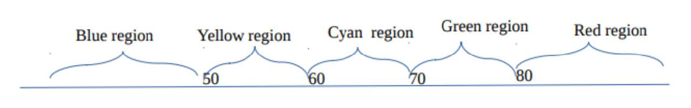

# Lab 5

1. Write a Java program that asks when you are leaving for work and outputs an appropriate message, according to the following rules:

- If leaving before 6, "Drive.''
- If leaving between 6 and 8 inclusive, "Take a train.''
- If leaving after 8, "Take a bus.''

2. Write a program that reads three edges for a triangle and computes the perimeter if the input is valid. Otherwise, display that the input is invalid. The input is valid if the sum of every pair of two edges is greater than the remaining edge.

3. Suppose you shop for rice in two different packages. You would like to write a program to compare the cost. The program prompts the user to enter the weight and price of the each package and displays the one with the better price. Here is a sample run:

```bash
Enter weight and price for package 1: 50 24.59
Enter weight and price for package 2: 25 11.99
Package 2 has a better price.
```

4. (Find the number of days in a month) Write a program that prompts the user to enter the month and year. Display the number of days in the month. For example, if the user entered month 2 and year 2012, your program should display 29 days. If the user entered month 3 and year 2015, your program should display 31 days.

- A year is a leap year if it is divisible by 4 but not by 100, or if it is
  divisible by 400. Use conditional statements and/or a switch
  statement.

5. (Financial application: calculate tips) Write a program that reads the subtotal and the gratuity rate, then compute and display the gratuity and total. For example, if the user enters 10 for subtotal and 15% for
   gratuity rate, the program displays $1.5 as gratuity and $11.5 as total.
   Here is a sample run:

```bash
Enter the subtotal and a gratuity rate: 10 15
The gratuity is $1.5 and the total is $11.5
```

<div style="page-break-after: always;"></div>

6. Write a switch statement to convert an int month to the month name. If the month is not a valid number give a statement that says something like “not a month”. You should use Scanner for this question.

- Now use a switch statement to display how many days are in a given month. The month is represented in int form.
  January, March, May, July, August, October, and December have 31 days April, June, September, and November have 30 days. February has 28 or 29.
- Now combine the two to take an int month and convert it to words and tell how many days it has.

7. A shipping company uses the following function to calculate the cost (in dollars) of shipping based on the weight of the package (in pounds):


- Write a program that prompts the user to enter the weight of the package and display the shipping cost. If the weight is greater than 20, display a message “the package cannot be shipped.” If the weight is 0 or less, say
  “the package cannot be a zero or a negative weight”.

8. Depending on the value of an int variable, t, a space is divided into 5 regions as shown in the picture. Write a Java program that outputs a message giving the correct region for that value of t.


