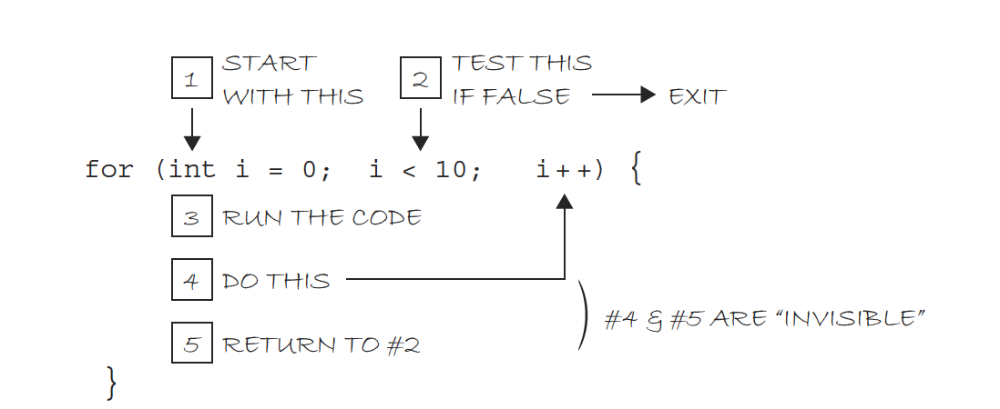

# Week 6: Computer Science 1

## Iteration

---

# Iteration

---

## What is Iteration?

<b>Iteration</b> is the process of repeating a set of instructions a specified number of times or until a specific condition is met. A computer loves to loop! It's one of the things it does best.

---

Let's say you want to print your name 10 times in a row. You could write 10 print statements, but that would be a lot of work. Instead, you could use a loop to repeat the print statement 10 times.

```java
System.out.println("Michael");
System.out.println("Michael");
System.out.println("Michael");
System.out.println("Michael");
System.out.println("Michael");
System.out.println("Michael");
System.out.println("Michael");
System.out.println("Michael");
System.out.println("Michael");
System.out.println("Michael");
```

Or you could write the print statement once and tell the computer to repeat it 10 times.

```java
for (int i = 0; i < 10; i++) {
    System.out.println("Michael");
}
```

---

## The For Loop

---

The <b>for loop</b> is a control structure that allows you to repeat a set of instructions a specified number of times. The for loop has three parts:

```java
for(initialization; condition; update){
    //Code block
}
```

1. The <b>initialization</b> statement: This is where you initialize the loop control variable. The loop control variable is used to keep track of the number of times the loop has executed.

2. The <b>condition</b> statement: This is where you specify the condition that must be true for the loop to continue executing.

3. The <b>update</b> statement: This is where you update the loop control variable. This statement is executed after each iteration of the loop.

---



1. <b>Initialization:</b> The loop control variable `i` is initialized to 0.

2. <b>Condition:</b> The condition `i < 10` is checked. If the condition is true, the loop continues executing. If the condition is false, the loop stops executing.

3. <b>Update:</b> The loop control variable `i` is incremented by 1.

---

### Initialization

Loops control variables are often named `i`, `j`, or `k`, but you can name them anything you want. 0 or 1 are common starting values. The initialization statement is only executed once, at the beginning of the loop.

**int i = 0** initializes the loop control variable `i` to 0.

```java
for (int i = 0; i < 10; i++) {
    //Code block
}
```

---

### Condition

The condition statement is evaluated before each iteration of the loop. If the condition is true, the loop continues executing. If the condition is false, the loop stops executing.

**i < 10** is the condition that must be true for the loop to continue executing.

```java
for (int i = 0; i < 10; i++) {
    //Code block
}
```

---

### Update

The update statement is executed after each iteration of the loop. It is used to update the loop control variable. You can increment, decrement, or update the loop control variable in any way you want.

**i++** is shorthand for **i = i + 1**.

```java
for (int i = 0; i < 10; i++) {
    //Code block
}
```

---

What does the following for loop output?

```java
for (int i = 0; i < 10; i++) {
    System.out.println(i);
}
```

---

Each time the loop iterates, the value of `i` is printed to the console. The loop control variable `i` is initialized to 0. The condition `i < 10` is checked. If the condition is true, the loop continues executing. If the condition is false, the loop stops executing. The loop control variable `i` is incremented by 1 after each iteration of the loop.

We start at `i = 0` until `i = 9`. After `i = 9`, the condition `i < 10` is false, so the loop stops executing.

```bash
0
1
2
3
4
5
6
7
8
9
```

---

Let's at the combination of the for loop and if statement.

```java
for (int num = 0; num < 10; num++) {
    if (num % 2 == 0) {
        System.out.println(num + " is even");
    } else {
        System.out.println(num + " is odd");
    }
}
```

What is the output?

---

```bash
0 is even
1 is odd
2 is even
3 is odd
4 is even
5 is odd
6 is even
7 is odd
8 is even
9 is odd
```

---

Notice you can use any variable name you want as the loop control variable. `num` is used in this example. The loop control variable `num` is initialized to 0. The condition `num < 10` is checked. The loop control variable `num` is incremented by 1 after each iteration of the loop.

Then we use an if statement to check if the number is even or odd using the modulo operator `%`.

```java
for (int num = 0; num < 10; num++) {
    if (num % 2 == 0) {
        System.out.println(num + " is even");
    } else {
        System.out.println(num + " is odd");
    }
}
```

---

## Examples

---

Print 1 through 10 on the same line using a for loop. Your initialization statement should start at 0. (We should NEVER hard code these numbers (ie. 1 through 10)).

---

```java
for (int i = 1; i <= 10; i++) {
    System.out.print(i + " ");
}
```

<b>Output:</b>

```bash
1 2 3 4 5 6 7 8 9 10
```

---

Find the sum of all the integers between 1 and 10 inclusive. Display the sum.

---

```java
int sum = 0;
for (int i = 1; i <= 10; i++) {
    sum += i;
}
System.out.println("The sum is " + sum);
```

<b>Output:</b>

```bash
The sum is 55
```

---

Print the positive numbers that are odd and less than 50.

---

With Modulo Operator:

```java
for (int i = 0; i < 50; i++) {
    if (i % 2 == 1) {
        System.out.print(i + " ");
    }
}
```

Without Modulo Operator:

```java
for (int i = 1; i < 50; i += 2) {
    System.out.print(i + " ");
}
```

<b>Output:</b>

```bash
1 3 5 7 9 11 13 15 17 19 21 23 25 27 29 31 33 35 37 39 41 43 45 47 49
```

---

Print 5 to -5 using a for loop.

---

```java
for (int i = 5; i >= -5; i--) {
    System.out.print(i + " ");
}
```

<b>Output:</b>

```bash
5 4 3 2 1 0 -1 -2 -3 -4 -5
```

---

Print the even numbers between 25 and 100 using a for loop.

---

With the Modulo Operator:

```java
for (int i = 25; i <= 100; i++) {
    if (i % 2 == 0) {
        System.out.print(i + " ");
    }
}
```

Without the Modulo Operator:

```java

for (int i = 26; i <= 100; i += 2) {
    System.out.print(i + " ");
}
```

<b>Output:</b>

```bash
26 28 30 32 34 36 38 40 42 44 46 48 50 52 54 56 58 60 62 64 66 68 70 72 74 76 78 80 82 84 86 88 90 92 94 96 98 100
```

---

Print the first 10 numbers in the Fibonacci sequence.

The Fibonacci sequence is a series of numbers in which each number is the sum of the two preceding ones, usually starting with 0 and 1.

So the sequence goes: 0, 1, 1, 2, 3, 5, 8, 13, 21, 34, ...

---

```java
int first = 0;
int second = 1;
int next;

for (int i = 0; i < 10; i++) {
    System.out.print(first + " ");
    next = first + second;
    first = second;
    second = next;
}
```

Notice that we are using three variables to keep track of the numbers in the sequence. `first` is initialized to 0 and `second` is initialized to 1, the first two numbers in the sequence. `next` is used to calculate the next number in the sequence.

---
