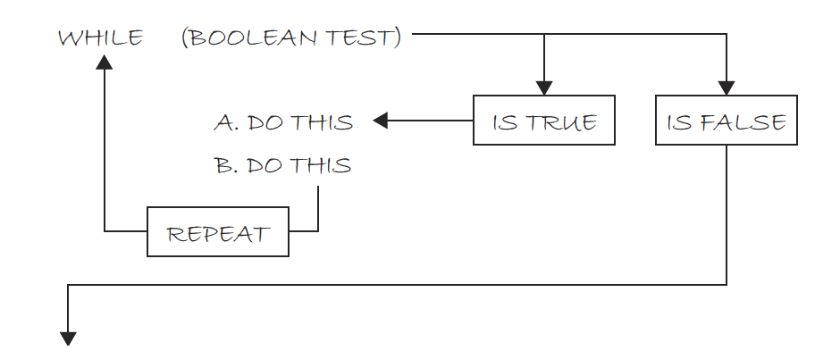

# Week 6: Computer Science 1

## Iteration Continued

---

# Iteration Continued

---

Let's review the concept of iteration. Remember that <b>iteration</b> is the process of repeating a set of instructions a specified number of times or until a specific condition is met.

So far, we've learned about <b>for loops</b> but Java has two other types of loops: <b>while loops</b> and <b>do-while loops</b>.

---

# While Loops

---

A <b>while loop</b> is a control flow statement that allows code to be executed repeatedly based on a given boolean condition. The while loop can be thought of as a repeating if statement.

```java
while (condition) {
    // code to be executed
}
```

---

There is an important distinction between a while loop and a for loop. A while loop is used when the number of iterations is not known before the loop starts.

```java
int count = 0;
while (count < 10) {
    System.out.println("Count is: " + count);
    count++;
}
```

---

```java
int count = 0;
while (count < 10) {
    System.out.println("Count is: " + count);
    count++;
}
```

Let's it down.

- <b>Intialization:</b> `int count = 0;` which is outside the loop.
- <b>Condition:</b> `count < 10` which is inside the loop.
- <b>Update:</b> `count++;` which is inside the loop.
- <b>Code block:</b> `System.out.println("Count is: " + count);` which is inside the loop.

The while loop is a deconstructed for loop. Where the parts of the for loop are separated into different parts of the code.

---



---

<b>For Loop:</b>

```java
for (int i = 0; i < 10; i++) {
    System.out.println("Count is: " + i);
}
```

<b>While Loop:</b>

```java
int count = 0;
while (count < 10) {
    System.out.println("Count is: " + count);
    count++;
}
```

What would happen if we forgot to increment `count` in the while loop? It would run forever! This is called an <b>infinite loop</b>.

<b>Note:</b> if you are stuck in an infinite loop, you can stop the program by pressing `Ctrl + C` in the terminal.

---

Why would you use a while loop instead of a for loop?

Generally, you would use a for loop when you know how many times you need to loop and a while loop when you don't know how many times you need to loop.

<b>For Loop</b>
Loop through the integers between 0 and 100. 100 is a known value.

<b>While Loop</b>
Break the loop based on a condition other than the number of times the loop has executed.

For example, asking the user to enter a specific value to break the loop.

---

In computer science, <b>"n"</b> often represents the size of the input to an algorithm or program. For example, in a loop that iterates on a list of numbers, <b>"n"</b> would represent the the number at which the loop stops.

When you don't know the size of your data, you can say that the size of the data is <b>"n"</b>.

So, if you don't know how many times you need to loop, you can use a while loop and say that the loop runs until <b>"n"</b> is reached.

An example sequence demonstrating incrementation by 1 from 0 up to "n" is:
0,1,2,3,4,...,n

This sequence illustrates numbers increasing by one, starting from 0 and ending at "n". In practice, a "while" loop checks its condition before each iteration, allowing it to adapt to varying data sizes, making it versatile for operations where the iteration count is not known beforehand or is condition-dependent.

---

```java
//User input to save the number of times to loop into a variable n.
int count = 0;
while (count < n) {
    System.out.println("Count is: " + count);
    count++;
}
```

In this example, the loop will run until `count` is equal to `n`. The value of `n` is determined by the user.

---

## Examples

---

Using a while loop, print the numbers 15 through 21.

---

```java
int count = 15;
while (count <= 21) {
    System.out.print(count + " ");
    count++;
}
```

<b>Output:</b>

```bash
15 16 17 18 19 20 21
```

---

Let's build our first <b>error checking</b> into a program.

Print the positive numbers that are odd and less than or equal to n using a while loop.

When you see n, that means that the program should work for any integer, meaning, use Scanner!

If a user tries entering a number that is negative or zero, we should print out, “Invalid input” and end the program.

---

```java
import java.util.Scanner;

public class Main
{
    public static void main(String[] args)
    {
        Scanner input = new Scanner(System.in);
        System.out.print("Enter a positive integer: ");

        int n = input.nextInt();

        if (n <= 0)
        {
            System.out.println("Invalid input");
        } else
        {
            int count = 1;
            while (count <= n)
            {

                System.out.print(count + " ");
                count+=2;
            }
        }
    }
}
```

---

Let's break it down.

- We import the Scanner class.
- We create a Scanner object called `input`.
- We prompt the user to enter a positive integer.
- We save the user's input into a variable called `n`.
- We check if `n` is less than or equal to 0. If it is, we print "Invalid input".
- If `n` is greater than 0, we create a variable called `count` and set it to 1.
- We use a while loop to print the numbers that are odd and less than or equal to `n`.
- We increment `count` by 2 each time the loop runs.

---

<b>(a)</b> Find the sum of all the integers between <b>1</b> and <b>n</b> inclusive using a loop. <b>n</b> must be greater than <b>1</b>. Display the sum.<br>
<b>(b)</b> Let’s make it so if a user tries entering a number less than or equal to 1, they have to try again until they enter a valid number.
<br>

This is an example of where a while loop and for loop are best for different scenarios. We don’t know how many times a user will enter an invalid number, so a while loop is best for input validation (part b). However, a for loop is best for finding the sum since we know how many times it will run (n times — part a).

---

```java

import java.util.Scanner;

public class Main
{
    public static void main(String[] args)
    {
        Scanner input = new Scanner(System.in);
        System.out.print("Enter an integer greater than 1: ");
        int n = input.nextInt();

        while (n <= 1)
        {
            System.out.print("Invalid value: Try again: ");
            n = input.nextInt(); //This will re-assign n to the new value.
        }

        int sum = 0;

        //Notice the control variable starts at 1.
        for (int i = 1; i <= n; i++)
        {
            sum += i;
        }
        System.out.println("The sum is " + sum);
    }
}
```

---

<b>Output:</b>

```bash
Enter an integer greater than 1: 0
Invalid value: Try again: -1
Invalid value: Try again: 5
The sum is 15
```

---

Let's try a few examples.

---

Print 5 to -5 using a while loop.

---

```java
int count = 5;

while (count >= -5) {
    System.out.print(count + " ");
    count--;
}
```

<b>Output:</b>

```bash
5 4 3 2 1 0 -1 -2 -3 -4 -5
```

---

- Print the even numbers between 25 and n using a while loop. n must be greater than 25.
- If n is 25 or less, print, “Invalid input” and end the program. Else, continue with the program.

---

```java

import java.util.Scanner;

public class Main
{
    public static void main(String[] args)
    {
        Scanner input = new Scanner(System.in);
        System.out.print("Enter an integer greater than 25: ");
        int n = input.nextInt();

        if (n <= 25)
        {
            System.out.println("Invalid input");
        } else
        {
            int count = 25;
            while (count <= n)
            {
                if (count % 2 == 0)
                {
                    System.out.print(count + " ");
                }
                count++;
            }
        }
    }
}
```

```bash
Enter an integer greater than 25: 30
26 28 30
```

---

## Scope

---

The scope of a variable is the part of the program where the variable can be accessed. In Java, the scope of a variable is determined by the location of the variable within the code.

In a for loop, the control variable is only accessible within the loop.

```java
for (int i = 0; i < 10; i++) {
    System.out.println(i);
}
```

In the previous example, `i` is only accessible within the for loop. If you try to access `i` outside of the loop, you will get an error.

---

Since the variable `i` is only accessible within the for loop, you can use the same variable name in another for loop.

```java
for (int i = 0; i < 10; i++) {
    System.out.println(i);
}

for (int i = 0; i < 5; i++) {
    System.out.println(i);
}
```

In this example, `i` is used in two different for loops. This is possible because the scope of `i` is limited to the for loop in which it is declared.

---

In a while loop, the control variable is accessible within the loop and outside of the loop.

```java
int count = 0;
while (count < 10) {
    System.out.println(count);
    count++;
}
```

In the previous example, `count` is accessible within the while loop and outside of the while loop.

---

Because the control variable is accessible outside of the loop, you need to be careful when using the same variable name in another loop. You can't declare the same variable name in the same scope but you can re-assign its value.

```java

int count = 0;
while (count < 10) {
    System.out.println(count);
    count++;
}

count = 5;
while (count > -10) {
    System.out.println(count);
    count--;
}
```

---

## Do-While Loops

---

A <b>do-while loop</b> is similar to a while loop, except that a do-while loop is guaranteed to execute at least one time.

```java
do {
    // code to be executed
} while (condition);
```

---

```java

int count = 0;
do {
    System.out.println(count);
    count++;
} while (count < 10);
```

- <b>Initialization:</b> `int count = 0;` which is outside the loop.
- <b>Code block:</b> `System.out.println(count);` which is inside the loop.
- <b>Update:</b> `count++;` which is inside the loop.
- <b>Condition:</b> `count < 10` which is executed after the loop.

---

The do-while loop is useful when you want to execute a block of code at least once, regardless of whether the condition is true or false.

It's possible with a for and while loop to have a condition that is always false, meaning the loop will never execute. This is not possible with a do-while loop.

```java
//This will execute at least once.
int count = 10;
do {
    System.out.println(count);
    count++;
} while (count < 10);
```

```java
//This will not execute.
int count = 10;
while (count < 10) {
    System.out.println(count);
    count++;
}
```

---
