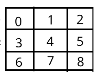

# Week 10: Computer Science 1

## Multidimensionality: 2D Arrays and Nested Loops

---

## Multidimensionality: 2D Arrays and Nested Loops

---

The idea of multidimensionality is a powerful concept in computer science.

A <b>dimension</b> is a measure of the size of an object in a particular direction.

<b>Zero dimension</b> is a point or in programming terms a single value.


```java
int number = 5;
```

---

<b>One dimension</b> is a line or in programming terms an array, a collection of values. We create a line creating two points and connecting them. The two points represent the start and end of the line.


```java
int[] numbers = new int[10];
```


---

All the elements in the array are stored in a single row and we can access them using a single index.

Print the first element in the array:

```java
int[] numbers = new int[10];
numbers[0] = 5;
System.out.println(numbers[0]);
```

or with a loop to print all the elements in the array:

```java
for (int i = 0; i < numbers.length; i++) {
    System.out.println(numbers[i]);
}
```

---

Let's expand the idea of dimensionality even further. We create a line by connecting two points. We can create a plane by connecting two lines. The two lines represent the start and end of the plane.


This is also referred to as a matrix. We can create a matrix by creating an array of arrays. Each row or column (depends on which way you count) represents a single array. Each element in the array is a value.


---

Let's create an array of arrays or a <b>2D array</b>:

```
type[][] name = new type[rows][columns];
```

---

Let's create a 2D array with 3 rows and 3 columns:

```java
int[][] numbers = new int[3][3];
```

We've added dimensionality to our data structure.

---

We can access the elements in the 2D array using two indices.

```java
numbers[0][0] = 3;
System.out.println(numbers[0][0]);
```

---

We can access all the elements of a 1D array using a loop and a single index. We can access all the elements of a 2D array using two loops and two indices. This is referred to as a <b>nested loop</b>.

```java
// For each row
for (int i = 0; i < numbers.length; i++) {
    // For each column
    for (int j = 0; j < numbers[i].length; j++) {
        System.out.println(numbers[i][j]);
    }
}
```

For each row, we iterate through each column and print the value.

Let's add values and see how this works.

---

```java
//Create a 3x3 matrix
int[][] numbers = new int[3][3];
//Counter to add values
int counter = 0;

for (int i = 0; i < numbers.length; i++) {
    for (int j = 0; j < numbers[i].length; j++) {
        numbers[i][j] = counter++;
    }
}

for (int i = 0; i < numbers.length; i++) {
    for (int j = 0; j < numbers[i].length; j++) {
        System.out.print(numbers[i][j]);
    }
    System.out.println();
}
```

What is the output?

---

Output:

```bash
012
345
678
```

---

We have a 3x3 matrix with values from 0 to 8. Remeber arrays are zero-based. The first row has values 0, 1, 2. The second row has values 3, 4, 5. The third row has values 6, 7, 8. So a 2D array size n x n has n^2 elements.



We can access the elements in the matrix using two indices. We can iterate through the matrix using two loops.

Let's access the elements in the matrix. Let's start with 2 in the first row and third column.

```java
System.out.println(numbers[0][2]);
```

---

How would we access the 7 in the third row and second column?


---

```java
System.out.println(numbers[2][1]);
```

```bash
7
```

---

We use the following formula to access the element in the matrix:

```java
numbers[row][column]
```

We can access the element in the matrix using two indices. The first index is the row and the second index is the column.

---

We are not limited to 2D arrays. We can create 3D arrays, 4D arrays, and so on. We can create a 3D array by creating an array of 2D arrays. Each 2D array represents a single layer in the 3D array. It goes on and one and on. We are going to stop at 2D arrays for now.

---

We are familiar with using 2D arrays in the real world. We can think of a 2D array as a table, spreadsheet, graph paper, etc. We can use a 2D array to represent a grid, a map, a game board, an image, etc. We project our 3D world onto the 2D screen of our computer.

---

Let's create a game of tic-tac-toe using a 2D array. We can represent the game board as a 3x3 matrix. We can use '1' and '2' to represent the players. We can use '0' to represent an empty space.

```java
int[][] board = new int[3][3];
```

```java
for (int i = 0; i < board.length; i++) {
    for (int j = 0; j < board[i].length; j++) {
        board[i][j] = 0;
        System.out.print(board[i][j]);
    }
    System.out.println();
}
```

```bash
000
000
000
```

---

Let's play the game. We can set the value of the element in the matrix to '1' or 'O'. We can use the following method to set the value of the element in the matrix.

```java
public static void setElement(int[][] board, int row, int column, int value) {
    int[row][column] = value;
}
```

---

Let's ask the user to enter the row and column to place their '1' or '2'. We can use the following method to get the row and column from the user.

```java
public static int[] getMove() {
    Scanner input = new Scanner(System.in);
    System.out.print("Enter the row , column, and mark: ");
    int row = input.nextInt();
    int column = input.nextInt();
    int mark = input.nextInt();
    int [] move = {row, column, mark};
    return move;
}
```

---

Let's continous ask the user to enter the row and column to place their '1' or '2' until the game is over. We can use the following method to check if the game is over, we can visually check to see if the game is over.

Can you think of a way to check if the game is over? Try to come up with a plan at lab.

---

Let's put the full program together:

```java
import java.util.Scanner;

public class TicTacToe {

    public static void main(String[] args) {
        int[][] board = new int[3][3];

        while (true) {
            printBoard(board);
            int[] move = getMove();
            setElement(board, move[0], move[1], move[2]);
        }
    }

    public static void printBoard(int[][] board) {
        for (int i = 0; i < board.length; i++) {
            for (int j = 0; j < board[i].length; j++) {
                System.out.print(board[i][j]);
            }
            System.out.println();
        }
    }

    public static void setElement(int[][] board, int row, int column, int value) {
        board[row][column] = value;
    }

    public static int[] getMove() {
        Scanner input = new Scanner(System.in);
        System.out.print("Enter the row , column, and mark: ");
        int row = input.nextInt();
        int column = input.nextInt();
        int mark = input.nextInt();
        int [] move = {row, column, mark};
        return move;
    }
}
```

---
