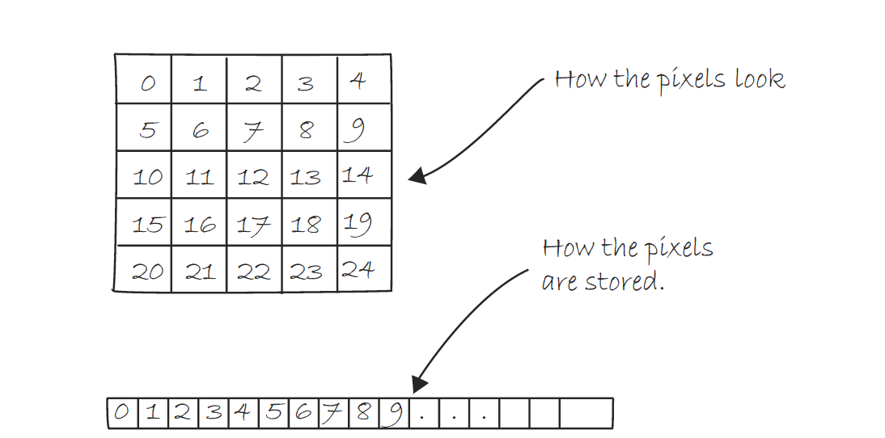
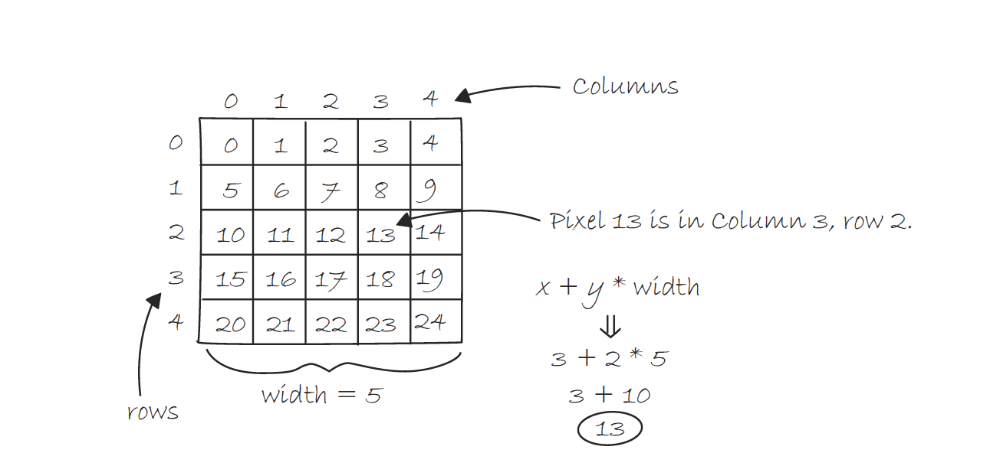

# Week 11: Computer Science 1

## Multidimensionality continued & Software Libraries

---

## Multidimensionality continued & Software Libraries

---

We have been using the Java **Standard Library** since the beginning of the semester. What is a **Software Library**?

A **Software Library** is a collection of pre-written code that can be used to perform common tasks.

Java has a vast **Standard Library** that is included with the Java Development Kit (JDK). It includes the Math class, the Scanner class, the String class, and many more.

Along with the **Standard Library**, there are many other libraries that can be used to perform more specialized tasks. These libraries are often open-source and can be found on the internet.

---

To extend the functionality of Java, we can use **Software Libraries** that contain pre-written code we can use in our programs.

One such Java Library is called **Processing**. Processing is a flexible software sketchbook and a language for learning how to code within the context of the visual arts.

Processing is a Java library that simplifies the process of creating visual programs. It is used by artists, designers, and students to create visual programs.

Here is a link to the Processing website: [Processing](https://processing.org/)

---

Processing is written in Java, so we can use the same Java syntax we have been learning. All the concepts we have learned in this class can be applied to Processing.

Here is an example of a simple Processing program that draws a circle on the screen:

```java
void setup() {
  size(500, 500);
}

void draw() {
  rect(200, 200, 100);
}
```

This program creates a window that is 500 pixels by 500 pixels and draws a circle at the coordinates (200, 200) with a diameter of 100 pixels. It's a simple program, close to the Hello World of programming visuals.

---

In Processing we can declare variables and arrays just like we do in Java. We can also use loops and conditionals to control the flow of our programs.

```java

int x = 100;
int y = 100;
double speed = 2.5;

for (int i = 0; i < 10; i++) {
  x += speed;
  y += speed;
  ellipse(x, y, 50, 50);
}

```

---

We can also create methods similar to Java. The only difference is that we don't need to include `public static` in front of the method declaration.

```java
void drawCircle(int x, int y, int diameter) {
  ellipse(x, y, diameter, diameter);
}
```

If you want to explore Processing further, you can download it from the Processing website and start creating visual programs.

Let's start using Processing for array manipulation.

---

First, let's talk about **Multidimensionality** in reference to visual programming.

In visual programming, we are manipulating the color values of the pixels on your screen. The screen is a 2D grid of pixels, and we can manipulate the color values of each pixel to create images.



---

Remember that 2D array is logically represented in a grid. Actually, it is stored in memory as sequential blocks of memory. We use the formaula `row * width + column` to access the elements of a 2D array.



---

```java

int[][] canvas;
int pixelSize = 20; // Size of each pixel
int cols, rows;

void setup() {
  size(400, 400);
  cols = width / pixelSize;
  rows = height / pixelSize;
  canvas = new int[rows][cols]; // Switched rows and cols here
  initializeCanvas();
}

void draw() {
  background(255);
  displayCanvas();
}

void mouseDragged() {
  int col = mouseX / pixelSize;
  int row = mouseY / pixelSize;
  if (col >= 0 && col < cols && row >= 0 && row < rows) {
    canvas[row][col] = 0; // Switched row and col here
  }
}

void initializeCanvas() {
  for (int i = 0; i < rows; i++) { // Iterate over rows first
    for (int j = 0; j < cols; j++) { // Then iterate over cols
      canvas[i][j] = 255; // Set all pixels to white initially
    }
  }
}

void displayCanvas() {
  for (int i = 0; i < rows; i++) { // Iterate over rows first
    for (int j = 0; j < cols; j++) { // Then iterate over cols
      fill(canvas[i][j]);
      noStroke();
      rect(j * pixelSize, i * pixelSize, pixelSize, pixelSize); // Switched i and j here
    }
  }
}

```
