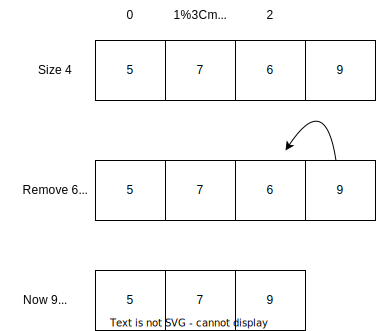

# Week 12: Computer Science 1

## ArrayLists

---

## ArrayLists

---

We have been using arrays to store data in our programs. Arrays are a fixed size, which means that once you create an array, you cannot change its size.

In your lab you created an array and then had to add one more item to it. You had to create a new array and copy all the items from the old array to the new array. It's cumbersome to manage arrays in this way. Lucky for us, Java has a solution for us.

Java has a class called `ArrayList` that is part of the `java.util` package. An `ArrayList` is a dynamic array that can grow or shrink in size.

---

Let's review the syntax of an `Array`:

```java
int[] numbers = new int[10];
```

This creates an array of 10 integers. You can access the elements of the array using the index:

```java
numbers[0] = 5;
numbers[1] = 10;
```

---

What if you want to add another element to the array? You would have to create a new array and copy all the elements from the old array to the new array.

```java
int[] newNumbers = new int[11];
for (int i = 0; i < numbers.length; i++) {
    newNumbers[i] = numbers[i];
}
newNumbers[10] = 15;
numbers = newNumbers;
```

This is a lot of code to add one element to an array. There has to be a better way.

---

An `ArrayList` is a dynamic array that can grow or shrink in size. You can add elements to an `ArrayList` without having to create a new array and copy all the elements.

To use an `ArrayList`, you must import the `java.util.ArrayList` class:

```java
import java.util.ArrayList;
```

Now you can create an `ArrayList`:

```java
ArrayList<Type> name = new ArrayList<Type>();
```

---

Let's analyze the syntax of an `ArrayList`:

```java
ArrayList<Type> name = new ArrayList<Type>();
```

- `ArrayList` is the class name.
- `<Type>` is the type of the elements in the `ArrayList`. Notice the capital `T`, this indicates the type is a class. We will discuss this further in the next slide.
- `name` is the name of the `ArrayList`.
- `new ArrayList<Type>()` is the constructor that creates a new `ArrayList`.
  <br>

You can see from the syntax that an `ArrayList` is a class. You can create an `ArrayList` object just like you would create any other object we have used in this class.

---

An `ArrayList` is a generic class. A generic class is a class that can work with any data type. You can specify the data type when you create an `ArrayList`.

```java
ArrayList<Integer> numbers = new ArrayList<Integer>();
```

In this example, we created an `ArrayList` of `Integer` objects. You can only add `Integer` objects to this `ArrayList`.

You might be thinking why is the `<Integer>` declaration uppercase?

---

An `ArrayList` can only store objects. Remember, objects are instances of classes. You cannot store primitive types in an `ArrayList`. You must use the wrapper classes.

```java
<Integer> // Integer objects
<Double> // Double objects
<String> // String objects
<Character> // Character objects
<Boolean> // Boolean objects
```

These different types are actually classes. You can tell be the capital letter. To be more specific they are <b>wrappers classes</b> for the primitive types.

---

Each generic type has a corresponding wrapper class:

- `int` has `Integer`
- `double` has `Double`
- `char` has `Character`
- `boolean` has `Boolean`

Notice I did not include `String`. `String` is a class, not a primitive type.

You can create a variable of the wrapper class and assign a primitive value to it:

```java
int number = 5;
Integer numberObject = new Integer(number);

double decimal = 3.14;
Double decimalObject = new Double(decimal);
```

---

Why do we need wrapper classes?

- `ArrayList` can only store objects. You cannot store primitive types in an `ArrayList`.
- Wrapper classes (or classes in general) have methods that allow you to perform operations on the primitive types.

In the hangman example, we use a method called `length()` to get the length of a `String`.

```java
String word = "hello";
int length = word.length();
```

The `length()` method is a method of the `String` class. The `length()` method is not a method of the `char` primitive type. Classes combine data storage with functionality. Where primitive types are just data storage.

---

Let's create an `ArrayList`:

```java
import java.util.ArrayList;

public class Main {
    public static void main(String[] args) {
        ArrayList<Integer> numbers = new ArrayList<Integer>();
    }
}
```

Now you have an `ArrayList` of `Integer` objects. You can add `Integer` objects to the `ArrayList`:

```java
numbers.add(5);
numbers.add(10);
```

The `add()` method adds an element to the end of the `ArrayList`.

---

You can access the elements of an `ArrayList` using the `get()` method:

```java
int number = numbers.get(0);
```

The `get()` method returns the element at the specified index. The index is zero-based just like an array.

You can also use the `set()` method to change the value of an element:

```java
numbers.set(0, 15);
```

The `set()` method takes two parameters: the index and the new value.

You can use the `remove()` method to remove an element:

```java
numbers.remove(0);
```

The `remove()` method takes the index of the element to remove.

---

To iterate over an `ArrayList`, you can use a `for` loop:

```java
for (int i = 0; i < numbers.size(); i++) {
    System.out.println(numbers.get(i));
}
```

The `size()` method returns the number of elements in the `ArrayList`.

You can use the `size()` method in the condition of the `for` loop to iterate over the `ArrayList`. Similar to the `length` property of an array.

You then use the `get()` method to access the elements of the `ArrayList`.

---

## Examples

---

Let's manipulate an `ArrayList`:

```java
import java.util.ArrayList;

public class Main {
    public static void main(String[] args) {
        ArrayList<Integer> numbers = new ArrayList<Integer>();
        numbers.add(5);
        numbers.add(10);
        numbers.add(15);
        numbers.add(20);
        numbers.add(25);

        numbers.set(0, 100);
        numbers.remove(2);

        for (int i = 0; i < numbers.size(); i++) {
            System.out.println(numbers.get(i));
        }
    }
}
```

---

Let's fill an `ArrayList` with random numbers:

```java

import java.util.ArrayList;

public class Main {
    public static void main(String[] args) {
        ArrayList<Integer> numbers = new ArrayList<Integer>();

        for (int i = 0; i < 10; i++) {
            numbers.add((int)(Math.random() * 10));
        }

        for (int i = 0; i < numbers.size(); i++) {
            System.out.println(numbers.get(i));
        }
    }
}
```

Why was I able to add a primitive type to the `ArrayList`?

---

When you add a primitive type to an `ArrayList`, Java automatically converts the primitive type to the corresponding wrapper class.

This is called <b>Autoboxing</b>. Autoboxing is the automatic conversion that the Java compiler makes between the primitive types and their corresponding wrapper classes.

When you add a primitive type to an `ArrayList`, Java automatically converts the primitive type to the corresponding wrapper class.

---

Let's add 1 to each element in the `ArrayList`

---

```java
import java.util.ArrayList;

public class Main {
    public static void main(String[] args) {
        ArrayList<Integer> numbers = new ArrayList<Integer>();

        for (int i = 0; i < 10; i++) {
            numbers.add((int)(Math.random() * 10));
        }

        for (int i = 0; i < numbers.size(); i++) {
            numbers.set(i, numbers.get(i) + 1);
        }

        for (int i = 0; i < numbers.size(); i++) {
            System.out.println(numbers.get(i));
        }
    }
}
```

We use the `get()` method as a parameter to the `set()` method to get the value of the element and add 1 to it.

---

Let's remove any even numbers from the `ArrayList`

---

```java

import java.util.ArrayList;

public class Main {
  public static void main(String[] args) {
        ArrayList<Integer> numbers = new ArrayList<Integer>();

        for (int i = 0; i < 10; i++) {
            numbers.add((int)(Math.random() * 10));
            System.out.println(numbers.get(i));
        }

        System.out.println("Remove Even Numbers:");
        for (int i = 0; i < numbers.size(); i++) {
            if (numbers.get(i) % 2 == 0) {
                numbers.remove(i);
            }
        }

        for (int i = 0; i < numbers.size(); i++) {
            System.out.println(numbers.get(i));
        }
    }
}
```

Why do I see even numbers?

---

When you remove an element from an `ArrayList`, the size of the `ArrayList` changes. The elements shift to the left. This means that the index of the elements changes.

<center>



</center>

How do I fix this?

---

We can iterate over the `ArrayList` in reverse order:

```java

import java.util.ArrayList;

public class Main {
    public static void main(String[] args) {
        ArrayList<Integer> numbers = new ArrayList<Integer>();

        for (int i = 0; i < 10; i++) {
            numbers.add((int)(Math.random() * 10));
            System.out.println(numbers.get(i));
        }

        System.out.println("Remove Even Numbers:");
        for (int i = numbers.size() - 1; i >= 0; i--) {
            if (numbers.get(i) % 2 == 0) {
                numbers.remove(i);
            }
        }

        for (int i = 0; i < numbers.size(); i++) {
            System.out.println(numbers.get(i));
        }
    }
}
```

---

You can also decrement the counting variable when you remove an element:

```java

import java.util.ArrayList;

public class Main {
    public static void main(String[] args) {
        ArrayList<Integer> numbers = new ArrayList<Integer>();

        for (int i = 0; i < 10; i++) {
            numbers.add((int)(Math.random() * 10));
            System.out.println(numbers.get(i));
        }

        System.out.println("Remove Even Numbers:");
        for (int i = 0; i < numbers.size(); i++) {
            if (numbers.get(i) % 2 == 0) {
                numbers.remove(i);
                i--;
            }
        }

        for (int i = 0; i < numbers.size(); i++) {
            System.out.println(numbers.get(i));
        }
    }
}
```

---

Let's create a program that allows a teacher to enter grades, calculate the average, find the maximum, and display the grades.

---

```java

import java.util.ArrayList;
import java.util.Scanner;

public class GradeAnalysis {

    public static void main(String[] args) {
        Scanner input = new Scanner(System.in);
        ArrayList<Integer> grades = inputGrades(input);

        if (grades.isEmpty()) {
            System.out.println("No grades were entered.");
        } else {
            printGrades(grades);
            printAverageGrade(grades);
            printMaximumGrade(grades);
        }

        input.close();
    }

    // Method to input grades
    public static ArrayList<Integer> inputGrades(Scanner input) {
        ArrayList<Integer> grades = new ArrayList<>();
        System.out.println("Enter grades (enter -1 to finish):");
        while (true) {
            int grade = input.nextInt();
            if (grade == -1) {
                break;
            }
            grades.add(grade);
        }
        return grades;
    }

    // Method to print all grades
    public static void printGrades(ArrayList<Integer> grades) {
        for (int i = 0; i < grades.size(); i++) {
            System.out.print(grades.get(i) + ", ");
        }
        System.out.println(); // Moves to the next line after listing all grades
    }

    //Method to calculate the average grade
    public static void printAverageGrade(ArrayList<Integer> grades) {
        int sum = 0;
        for (int i = 0; i < grades.size(); i++) {
            sum += grades.get(i);
        }
        double average = (double) sum / grades.size();
        System.out.println("Average grade: " + average);
    }

    // Method to find and print the maximum grade
    public static void printMaximumGrade(ArrayList<Integer> grades) {
        int max = grades.get(0);
        for (int i = 1; i < grades.size(); i++) {
            if (grades.get(i) > max) {
                max = grades.get(i);
            }
        }
        System.out.println("Maximum grade: " + max);
    }
}
```

---
