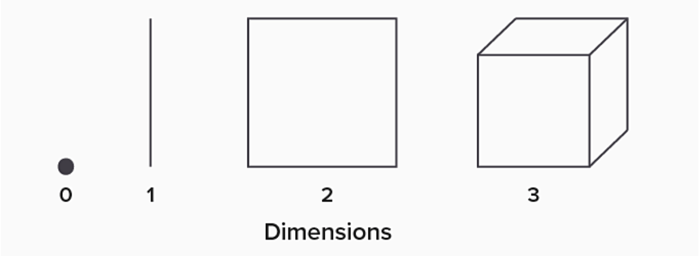
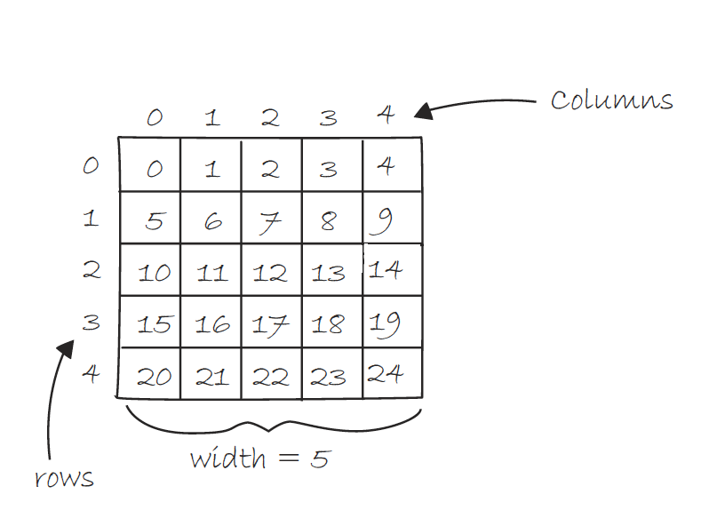

# Week 12: Computer Science 1

## Exam 3 Review

---

## Exam 3 Review

---

We have been building concepts and tools on top of each other. We started with variables and control structures. Then moved to input and loops. Then methods and arrays. Finally, 2D arrays and nested loops.

All these concepts are interconnected and build on top of each other.

---

### Variables -> Control Structures -> Loops -> Methods

Our knowledge of variables brought us to comparing values and making decisions. We used loops to repeat these tasks. Then we used methods to organize our code into reusable blocks.

---

### Variables -> Arrays -> Loops -> 2D Arrays -> Nested Loops

Our knowledge of variables also allowed us to create collections of these individual values. We used arrays to store these collections. Then we used loops to iterate over them. We create a collection of collections with 2D arrays. Then used nested loops to iterate over them.

---

### Main Topics

- Methods
- Arrays
- 2D Arrays
- Nested Loops

---

### Methods

---

Methods are blocks of code that perform a specific task.

We have been using methods since the beginning of the course. We have been using the `main` method to run our programs.

Now we can create our own methods to organize our code.

---

Let's review the syntax of a method:

```java
public static returnType methodName(parameters) {
    // code to be executed
}
```

- `public` is an access modifier
- `static` means the method belongs to the class and not an object
- `returnType` is the data type of the value the method returns
- `methodName` is the name of the method
- `parameters` is the data the method needs to perform its task

---

We can call a method by using its name followed by parentheses:

```java
methodName(parameters);
```

The parameters are the values we pass to the method. When we call a method the parameters must match the data type and order of the method's parameters in the method definition.

---

```java

public class Main {
    public static void main(String[] args) {
        int sum = add(5;
        System.out.println(sum);
    }

    public static int add(int a) {
        return a + a;
    }
}

```

We are calling the `add` method with the parameter `5`. The method returns `5 + 5` which is `10`, an integer value that matches the return type of the method. The parameter matches the data type of the method's parameter.

---

Methods can have a return type of any data type. Including, `int`, `double`, `String`, `boolean`, and `void`.

If the method does not return a value, the return type is `void`.

---

A method can have multiple parameters. The parameters are separated by commas.

```java
public static void main(String[] args) {
    int sum = add(5, 10, 15);
    System.out.println(sum);
}

public static int add(int a, int b, int c) {
    return a + b + c;
}
```

---

You can have multiple methods with the same name as long as the parameters are different. This is called <b>method overloading.</b>

```java
public static void main(String[] args) {
    int sum = add(5, 10);
    System.out.println(sum);
    double sum2 = add(5.5, 10.5);
    System.out.println(sum2);
}

public static int add(int a, int b) {
    return a + b;
}

public static double add(double a, double b) {
    return a + b;
}
```

---

When you pass a variable to a method, you are passing a copy of the variable. So if you change the value of the variable in the method, it does not change the value of the variable outside the method.

```java
public static void main(String[] args) {
    int number = 5;
    changeNumber(number);
    System.out.println(number);
}

public static void changeNumber(int num) {
    num = 10;
}
```

When we print `number` it will still be `5`.

---

If you want to change the value of a variable in a method, you can use a return statement.

```java
public static void main(String[] args) {
    int number = 5;
    number = changeNumber(number);
    System.out.println(number);
}

public static int changeNumber(int num) {
    return num * 2;
}
```

When we print `number` it will be `10`.

---

### Arrays

---

An array is a collection of variables of the same data type. Each variable in the array is called an element. This collection is stored in a single variable and we can access each element by its index.

---

Let's review the syntax of an array:

```java
dataType[] arrayName = new dataType[size];
```

- `dataType` is the data type of the elements in the array. All the data types must be the same.

- `arrayName` is the name of the array.

- `size` is the number of elements in the array. This is a fixed size and cannot be changed.

- `new` is a keyword that creates the array.

---

We can access the elements of an array by their index. The index starts at `0` and goes to `size - 1` or `n - 1`.

```java
int[] numbers = new int[5];
numbers[0] = 5;
numbers[1] = 10;
numbers[2] = 15;
numbers[3] = 20;
numbers[4] = 25;
```

---

We can declare and initialize an array in one line:

```java
int[] numbers = {5, 10, 15, 20, 25};
```

This statment creates an array with 5 elements and assigns the values `5`, `10`, `15`, `20`, and `25` to the elements. The array is created with the size of the number of elements.

---

We can use a loop to iterate over the elements of an array:

```java
int[] numbers = {5, 10, 15, 20, 25};
for (int i = 0; i < numbers.length; i++) {
    System.out.println(numbers[i]);
}
```

This loop will print each element of the array. The `numbers.length` is the number of elements in the array. Numbers has a length of `5`.

---

We can pass an array to a method. When we pass an array we are passing a reference to the array. This means we are passing the memory address of the array. So if we change the elements of the array in the method, it will change the elements of the array outside the method.

```java
public static void main(String[] args) {
    int[] numbers = {5, 10, 15, 20, 25};
    changeArray(numbers);
    for (int i = 0; i < numbers.length; i++) {
        System.out.println(numbers[i]);
    }
}

public static void changeArray(int[] nums) {
    nums[0] = 100;
}
```

The first element of the numbers array in the main method will be `100` after the `changeArray` method is called.

---

### 2D Arrays & Nested Loops

---

We introduced the concept of multidimensional data structures.

<center>



</center>

- 0D - Variable
- 1D - Array
- 2D - 2D Array
- 3D - 3D Array
- And on...

---

A 2D array is an array of arrays. Each element of the array is an array. This creates a grid of elements. We can access the elements of a 2D array by their row and column.



---

Let's review the syntax of a 2D array:

```java
dataType[][] arrayName = new dataType[rows][columns];
```

The syntax is similar to a 1D array. We add another set of brackets to create the 2D array.

---


We can access the elements of a 2D array by their row and column:

```java
int[][] numbers = new int[5][5];
numbers[0][0] = 0;
numbers[0][1] = 1;
numbers[0][2] = 2;
numbers[0][3] = 3;
numbers[0][4] = 4;
numbers[1][0] = 5;
```

---

We can declare and initialize a 2D array in one line:

```java

int[][] numbers = {
    {0, 1, 2, 3, 4},
    {5, 6, 7, 8, 9},
    {10, 11, 12, 13, 14},
    {15, 16, 17, 18, 19},
    {20, 21, 22, 23, 24}
};

```

---

We can use nested loops to iterate over the elements of a 2D array:

```java
int[][] numbers = {
    {0, 1, 2, 3, 4},
    {5, 6, 7, 8, 9},
    {10, 11, 12, 13, 14},
    {15, 16, 17, 18, 19},
    {20, 21, 22, 23, 24}
};

for (int i = 0; i < numbers.length; i++) {
    for (int j = 0; j < numbers[i].length; j++) {
        System.out.println(numbers[i][j]);
    }
}
```

The outer loop iterates over the rows and the inner loop iterates over the columns.

---

```java
for (int i = 0; i < numbers.length; i++) {
    for (int j = 0; j < numbers[i].length; j++) {
        System.out.println(numbers[i][j]);
    }
}
```

When you called `numbers.length` you are getting the number of rows in the 2D array. When you call `numbers[i].length` you are getting the number of columns in the row. All the rows have the same number of columns so you can use any row to get the number of columns.

---

Practice these concepts and review the code examples in the lecture notes, labs, and quizzes.

Be comfortable with the syntax and how to use these concepts in your programs. You will need to solve problems using these concepts on the exam.

You will be allowed one handwritten single-sided 8.5" x 11" sheet of notes for the exam. If you need to remember the syntax of a method or array, write it on your notes.
