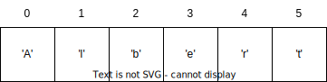

# Week 13: Computer Science 1

## Classes & Strings

---

## Classes

---

We have been using one class in our programs: the `Main` class. We have been creating objects of other classes, but we have not created our own classes. This is a fundamental concept in object-oriented programming. While creating classes is a topic that will be covered in CS2 understanding the basic concepts is important.

---

What is a class? A class is a structure that allows us to combine data storage and functionality into a single unit.

Data Storage: Variables, Arrays, ArrayLists, etc.
Functionality: Methods

A class is a blueprint for creating objects. An object is an instance of a class.

- Cookie cutter is the class. Cookies are objects of the class.
- Human is the class. Albert Einstein is an object of the class Human.

---

Let's play with a toy example of a class. We will create a class called `Person` that has two variables: `name` and `age`. We will also create a method called `sayHello` that will print a message to the console.

---

```java
class Person {

    String name;
    int age;

    public void sayHello() {
        System.out.println("Hello, my name is " + name + " and I am " + age + " years old.");
    }

}
```

---

Now let's create a person object called Albert and call the `sayHello` method.

```java
public class Main {

    public static void main(String[] args) {

        Person albert = new Person();
        albert.name = "Albert";
        albert.age = 42;

        albert.sayHello();

    }

}
```

---

The concept of classes is essential to object-oriented programming. It's called Object-Oriented Programming for a reason. We create objects of classes and interact with them.

This should help to better understand how we can use prebuilt classes like `String` and `ArrayList`.

---

## Strings

---

Strings are a sequence of characters. In Java, strings are objects of the `String` class. Strings are immutable, meaning they cannot be changed once they are created.

```java
String name = "Albert";
```

Strings are represented in memory as an array of characters.



---

From the basic understanding we have of classes, we can see that the `String` class has methods that allow us to interact with strings. For example, the `length` method returns the number of characters in a string.

```java
String name = "Albert";
int length = name.length();
System.out.println(length); // 6
```

---

The `String` class has many methods that allow us to manipulate strings.

- `charAt(int index)`: Returns the character at the specified index.
- `substring(int beginIndex, int endIndex)` or `substring(int beginIndex)`: Returns a substring starting from the specified begin index or begin and ending.
- `toUpperCase()`: Returns a string in uppercase.
- `toLowerCase()`: Returns a string in lowercase.
- `compareTo(String anotherString)`: Compares two strings and returns an integer.
- `equals(Object anObject)`: Compares two strings and returns a boolean value.
- `indexOf(String str)`: Returns the index within the string of the first occurrence of the specified substring.
- `split(String regex)`: Splits the string into an array of strings based on the specified regular expression.
- `contains(String str)`: Returns a boolean value based on whether the string contains the specified sequence of characters.

---

We have already used some of these methods in our programs. When we use Scanner and want to read in one character at a time, we use the `charAt` method.

`charAt(int index)`: Returns the character at the specified index.

```java
String name = "Albert";
char firstLetter = name.charAt(0);
System.out.println(firstLetter); // A
```

---

With primitive data types, we can use `==` to compare values. With objects, we use the `equals` method. The `equals` method compares the values of two objects.

`equals(Object anObject)`: Compares two strings and returns a boolean value.

```java
String name1 = "Albert";
String name2 = "Albert";
boolean isEqual = name1.equals(name2);
System.out.println(isEqual); // true
```

---

`toUpperCase()`: Returns a string in uppercase.
`toLowerCase()`: Returns a string in lowercase.

```java
String name = "Albert";
String upperCaseName = name.toUpperCase();
String lowerCaseName = name.toLowerCase();
System.out.println(upperCaseName); // ALBERT
System.out.println(lowerCaseName); // albert
```

---

`substring(int beginIndex, int endIndex)`: Returns a substring starting from the specified begin index and ending at the specified end index.


```java
String name = "Albert";
String subName1 = name.substring(2);
String subName2 = name.substring(2, 4);
System.out.println(subName1); // bert
System.out.println(subName2); // be
```

---

`indexOf(String str)`: Returns the index within the string of the first occurrence of the specified substring.


```java
String name = "Albert";
int index = name.indexOf("be");
System.out.println(index); // 2

int index2 = name.indexOf("r");
System.out.println(index2); // 4

int index3 = name.indexOf("z");
System.out.println(index3); // -1 (not found)
```

---

`split(String regex)`: Splits the string into an array of strings based on the specified regular expression.

```java
String name = "Albert Einstein";
String[] names = name.split(" ");
System.out.println(names[0]); // Albert

String firstName = names[0];

System.out.println(names[1]); // Einstein

String lastName = names[1];
```

---

`contains(String str)`: Returns a boolean value based on whether the string contains the specified sequence of characters.

```java
String name = "Albert";
boolean contains = name.contains("be");
System.out.println(contains); // true

boolean contains2 = name.contains("z");
System.out.println(contains2); // false
```

---

Along with the `String` class, the `Character` wrapper class has methods that allow us to interact with characters.

- `isDigit(char ch)`: Determines if the specified character is a digit.
- `isLetter(char ch)`: Determines if the specified character is a letter.
- `isLetterOrDigit(char ch)`: Determines if the specified character is a letter or digit.
- `isLowerCase(char ch)`: Determines if the specified character is a lowercase letter.
- `isUpperCase(char ch)`: Determines if the specified character is an uppercase letter.

---

## Examples

---

Let's create a method that prints each character of a string on a new line.

---

```java

public class Main {

    public static void main(String[] args) {

        printCharacters("Albert");

    }

    public static void printCharacters(String str) {

        for (int i = 0; i < str.length(); i++) {
           System.out.println(str.charAt(i));
        }

    }

}
```

---

Let's create a method that prints a string and capitalizes every other letter.

---

```java

public class Main {

    public static void main(String[] args) {

        capitalizeEveryOtherLetter("Albert");

    }

    public static void capitalizeEveryOtherLetter(String str) {

        for (int i = 0; i < str.length(); i++) {
            if (i % 2 == 0) {
                System.out.print(Character.toUpperCase(str.charAt(i)));
            } else {
                System.out.print(str.charAt(i));
            }
        }

    }

}
```

---

Write a method that takes two strings as parameters. If the
second string occurs in the first string, it should return a string that has the second string capitalized and moved to the end of the string.

Example:

```java
String str1 = "Albert Einstein";
String str2 = "ein";
String result = moveToEnd(str1, str2);
System.out.println(result); // Albert EinstEIN
```

---

```java

public class Main {

    public static void main(String[] args) {

        String str1 = "Albert Einstein";
        String str2 = "ein";
        String result = moveToEnd(str1, str2);
        System.out.println(result); // Albert EinstEIN

    }

    public static String moveToEnd(String str1, String str2) {

        int index = str1.indexOf(str2);

        if (index != -1) {
            String subStr1 = str1.substring(0, index);
            String subStr2 = str1.substring(index, index + str2.length());
            String subStr3 = str1.substring(index + str2.length());

            return subStr1 + subStr3 + subStr2.toUpperCase();
        }

        return str1;

    }

}
```

---

Create a program that reads names in from the user until the user enters "quit". The program should store the names in an ArrayList. The program then should ask the user to enter another name to be searched for in the ArrayList. If the name is found, the program should print "Name found" and the index in the ArrayList. If the name is not found, the program should print "Name not found."

---

```java

import java.util.ArrayList;
import java.util.Scanner;

public class Main {

    private static Scanner scanner = new Scanner(System.in);

    public static void main(String[] args) {
        ArrayList<String> names = collectNames();
        searchName(names);
    }

    public static ArrayList<String> collectNames() {
        ArrayList<String> names = new ArrayList<>();
        String name = "";

        while (!name.equals("quit")) {
            System.out.print("Enter a name: ");
            name = scanner.nextLine();
            if (!name.equals("quit")) {
                names.add(name);
            }
        }

        return names;
    }

    public static void searchName(ArrayList<String> names) {
        System.out.print("Enter a name to search for: ");
        String searchName = scanner.nextLine();

        if (names.contains(searchName)) {
            System.out.println("Name found at index " + names.indexOf(searchName));
        } else {
            System.out.println("Name not found");
        }
    }
}

```
