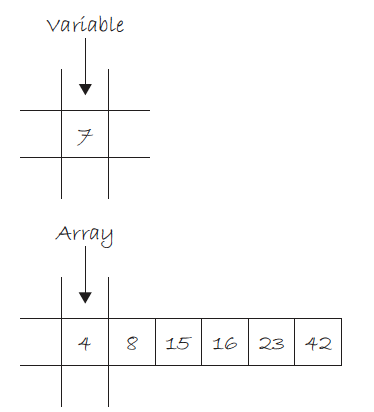
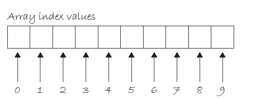

# Week 9: Computer Science 1

## Data Structures

---

## Data Structures

---

We have been storing data in variables as discrete pieces of information. Each variable can hold a single piece of data. What if you want to store a collection of data?

This is where data structures come in and the first structure we will look at is the <b>array</b>.

---

## Arrays

---

An <b>array</b> is a collection of items (variables, objects) stored at contiguous memory locations. The idea is to store multiple items of the same type together.

For example, an array of integers will store multiple integers together.

<center>



</center>

---

We declare an array in Java like this:

```java
type[] arrayName = new type[size];
```

- `type` is the type of the array. This is the type of the data that the array will hold.
- `[]` is the array operator. It tells Java that this is an array.
- `arrayName` is the name of the array.
- `new type[size]` This tells Java to allocate memory for `size` elements of type `type`.

---

We declare an array of ten integers in Java like this:

```java
int[] numbers = new int[10];
```

This creates an array that can hold 10 integers.

Let's look at the parts of this declaration.

- `int` is the type of the array. This is the type of the data that the array will hold.
- `[]` is the array operator. It tells Java that this is an array.
- `numbers` is the name of the array.
- `new int[5]` This tells Java to allocate memory for 5 integers.

---

Arrays can hold values of any type, including the all the primitive types and objects.

```java
int[] numbers = new int[10]; // array of 10 integers
double[] prices = new double[10]; // array of 10 doubles
String[] names = new String[100]; // array of 100 strings
```

---

## Assigning & Accessing Array Elements

---

We can access the elements of an array using the index of the element. The index is the position of the element in the array. The first element is at index 0, the second element is at index 1, and so on. This is called <b>zero-based indexing</b>.

If I declare an array of 10 integers the array will be indexed from 0 to 9.

```java
int[] numbers = new int[10];
```

<center>



</center>

For any array size `n`, the index of the last element is `n - 1`.<br> An array of 10 elements will have the last element at index 9.

---

We now can declare an array and access the elements of the array. The next step is to assign values to the elements of the array.

```java
int[] numbers = new int[10];
numbers[0] = 10;
```

This assigns the value `10` to the first element of the array at index `0`. We have to use the index operator `[]` to access the element of the array. We have 9 more elements to assign values, let's fill them in.

---

<center>


</center>

```java
int[] numbers = new int[10];
numbers[0] = 10;
numbers[1] = 20;
numbers[2] = 30;
numbers[3] = 40;
numbers[4] = 50;
numbers[5] = 60;
numbers[6] = 70;
numbers[7] = 80;
numbers[8] = 90;
numbers[9] = 100;
```

I've assigned values to all the elements of the array.

---

Now that I have assigned values to the elements of the array, I can access the elements of the array and use them in my program.

```java
System.out.println(numbers[0]); // prints 10
```

I can use the elements of the array in the same way I use any other variable.

```java
int sum = numbers[0] + numbers[1] + numbers[2];
System.out.println(sum); // prints 60
```

I can assign the value of an element of the array to another variable.

```java
int first = numbers[0];
System.out.println(first); // prints 10
```

---

What happens if I try to access the whole array at once?

```java
System.out.println(numbers); // prints something like [I@6d06d69c
```

This is not what I expected. This is the memory address of the array. Remember that an array is a collection of items stored at contiguous memory locations. The memory address is the address of the first element of the array.

This is called a <b>reference</b> to the array. The reference is the memory address of the first element of the array.

---

Think back to for loops and how we started the loop at 0 instead of 1? <p>This is to match the zero-based indexing of arrays. For loops are the perfect tool to use when working with arrays.

Let's access all the elements of the array using a for loop.

```java
for (int i = 0; i < numbers.length; i++) {
    System.out.println(numbers[i]);
}
```

Our array has 10 elements, so the loop will run 10 times. The loop will start at index 0 and end at index 9.

`.length` is a property of the array that returns the number of elements in the array.

---

Let's look at arrays with other types such as doubles and strings.

```java
double[] prices = new double[2];
prices[0] = 10.99;
prices[1] = 20.99;
```

They work the same way as the integer array.

```java

String[] names = new String[3];
names[0] = "Alice";
names[1] = "Bob";
names[2] = "Charlie";
```

Notice the `String` array has 3 elements and is storing an object. Arrays can store objects as well as primitive types.

---

We can also declare and initialize an array in one step.

```java
int[] numbers = {10, 20, 30, 40, 50, 60, 70, 80, 90, 100};
String[] names = {"Alice", "Bob", "Charlie"};
```

This creates an array of 10 integers and an array of 3 Strings, assigning the values to the elements of the array in one step. Instead of using the `new` operator, we use the `{}` operator to declare and initialize the array.

---

Let's start to use arrays in our programs. First, let's make a helper `method` that will print the elements of an array.

```java
public static void printArray(int[] array) {
    for (int i = 0; i < array.length; i++) {
        System.out.println(array[i]);
    }
}
```

This method takes an array of integers as a parameter and prints the elements of the array. Notice the return type of the method is `void`. This means the method does not return a value.

---

Now we can use the `printArray` method to print the elements of an integer array.

Create an array of with the following values:<br>
`-5, 20, 33, 140, 510, -30, 100, -65, 90, 1`

Then call the `printArray` method with the array as the argument.

---

```java

public class Main {
    public static void main(String[] args) {
        int[] numbers = {-5, 20, 33, 140, 510, -30, 100, -65, 90, 1};
        printArray(numbers);
    }

    public static void printArray(int[] array) {
        for (int i = 0; i < array.length; i++) {
            System.out.println(array[i]);
        }
    }
}
```

---

Using a method to print the elements of an array is a good example of <b>code reuse</b>. We can use the `printArray` method to print the elements of any integer array. We don't have to write the code to print the elements of the array every time we want to print the elements of an array.

Why not create `printArray` methods for the other types of arrays? We can use method overloading and Java will know which method to use based on the type of the array.

---

```java
public static void printArray(int[] array) {
    for (int i = 0; i < array.length; i++) {
        System.out.println(array[i]);
    }
}

public static void printArray(double[] array) {
    for (int i = 0; i < array.length; i++) {
        System.out.println(array[i]);
    }
}

public static void printArray(String[] array) {
    for (int i = 0; i < array.length; i++) {
        System.out.println(array[i]);
    }
}
```

Now we have a `printArray` methods that can print the elements of an integer array, a double array, and a string array. We just have to pass an array to `printArray` and Java will know which method to use.

---

Create three different arrays, one of each type, and call the `printArray` method with each array as the argument.

---

```java

public class Main {
    public static void main(String[] args) {
        int[] numbers = {-5, 20, 33, 140, 510, -30, 100, -65, 90, 1};
        double[] prices = {10.99, 20.99, 30.99};
        String[] names = {"Alice", "Bob", "Charlie"};
        printArray(numbers);
        printArray(prices);
        printArray(names);
    }

    public static void printArray(int[] array) {
        for (int i = 0; i < array.length; i++) {
            System.out.println(array[i]);
        }
    }

    public static void printArray(double[] array) {
        for (int i = 0; i < array.length; i++) {
            System.out.println(array[i]);
        }
    }

    public static void printArray(String[] array) {
        for (int i = 0; i < array.length; i++) {
            System.out.println(array[i]);
        }
    }
}
```

---

## Scope of Arrays

---

Let's review the scope of a variable that is passed to a method.

```java
public class Main {
    public static void main(String[] args) {
        int num = 10;
        printVariable(num);
        System.out.println(num);
    }

    public static void printVariable(int num) {
        System.out.print(num + " ");
        num++;
    }
}
```

What will be printed to the console?

```bash
10 10
```

---

```java
public class Main {
    public static void main(String[] args) {
        int num = 10;
        printVariable(num);
        System.out.println(num);
    }

    public static void printVariable(int num) {
        System.out.print(num + " ");
        num++;
    }
}
```

Even though the `num` variable is incremented in the `printVariable` method, the value of `num` in the `main` method is not changed. This is because the `num` variable is passed to the `printVariable` method by value. This means a copy of the `num` variable is passed to the `printVariable` method.

---

What happens if we pass an array to a method?

```java
public class Main {
    public static void main(String[] args) {
        int[] numbers = {10, 20, 30, 40, 50};
        printArray(numbers);

        for (int i = 0; i < numbers.length; i++) {
            System.out.print(numbers[i] + " ");
        }
    }

    public static void printArray(int[] array) {
        for (int i = 0; i < array.length; i++) {
            System.out.print(array[i] + " ");
            array[i]++;
        }
    }
}
```

What will be printed to the console?

```bash
10 20 30 40 50 11 21 31 41 51
```

---

The value of `numbers` in the `main` method is changed even though the `numbers` array is passed to the `printArray` method. This is because the `numbers` array is passed to the `printArray` method by reference. This means the memory address of the `numbers` array is passed to the `printArray` method.

When the `printArray` method changes the elements of the `numbers` array, it is changing the elements of the `numbers` array in the `main` method.

---
